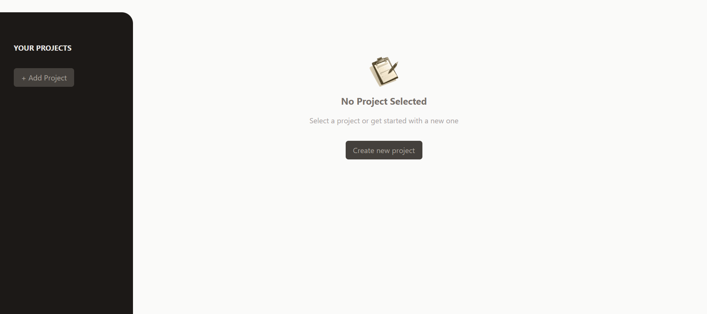
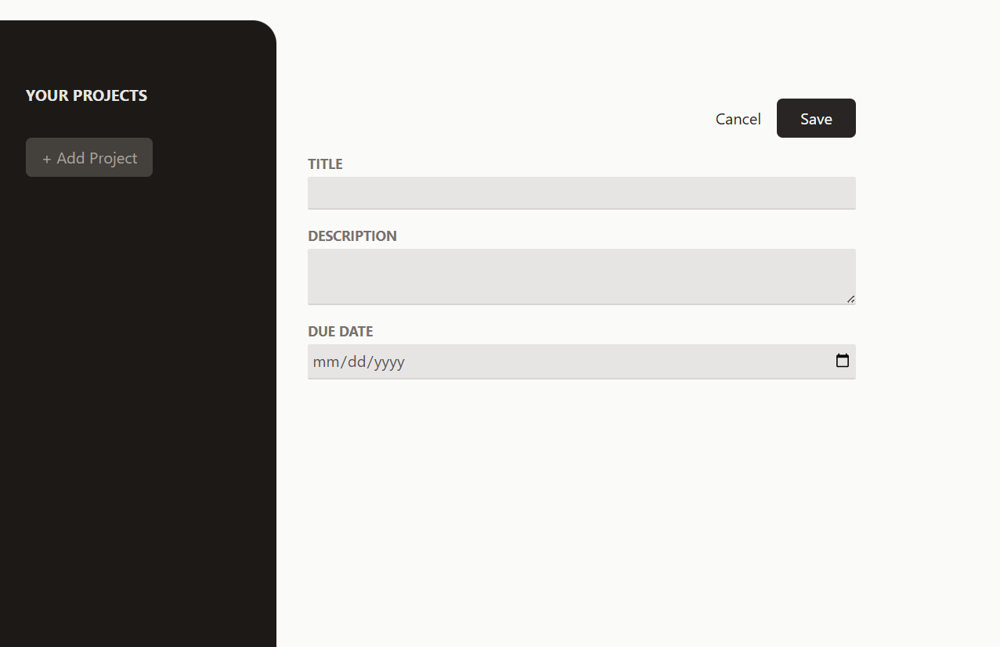
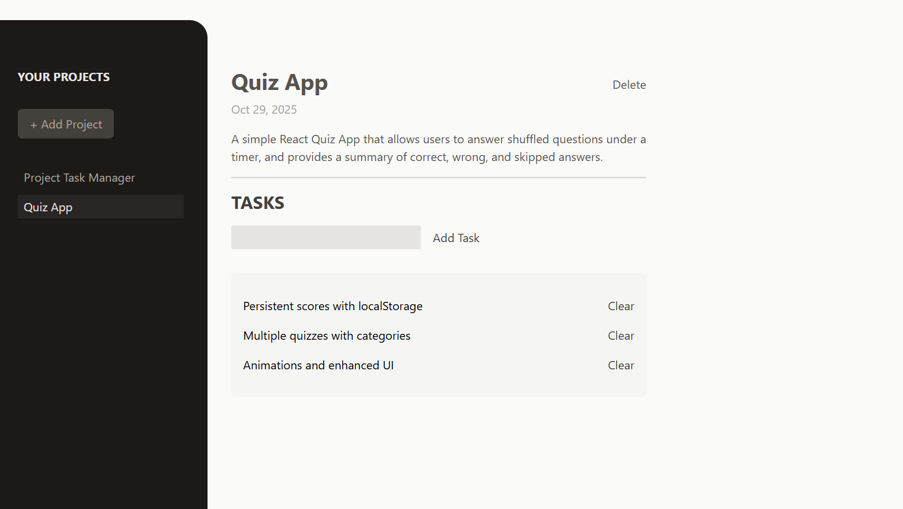
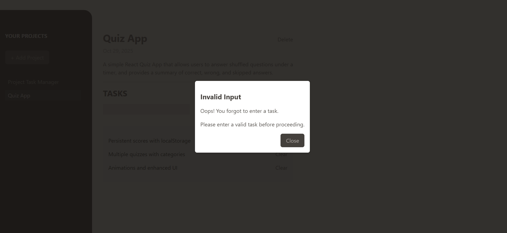

# 📌 Project Task Manager


A simple **React.js application** to manage projects and their tasks.
Users can create multiple projects, add and delete tasks for each project.
Built with **React + TailwindCSS** for a clean UI and state management using React hooks.

---

## 🚀 Features

- 📂 Create and delete projects
- 📝 Add and delete tasks per project
- ⚡ Validation with modal dialogs (invalid input handling)
- 🎨 Styled with TailwindCSS
- 🗂 Organized components structure
- 🔄 Real-time state updates (React useState)

---

## 🛠️ Tech Stack

- **React** (with hooks)
- **TailwindCSS**
- **JavaScript (ES6+)**
- **Vite** (for development and build)

---

## 📂 Project Structure

```text
src/
├─ components/
│  ├─ Project/
│  │  ├─ NewProject.jsx
│  │  ├─ NoProjectSelected.jsx
│  │  ├─ SelectedProject.jsx
│  ├─ Task/
│  │  ├─ NewTask.jsx
│  │  ├─ Tasks.jsx
│  ├─ Sidebar/
│  │  ├─ ProjectsSidebar.jsx
│  ├─ UI/
│  │  ├─ Modal.jsx
│  │  ├─ Input.jsx
│  │  ├─ Button.jsx
├─ App.jsx
├─ index.css
├─ main.jsx
```

---

## ⚙️ Installation & Usage

Clone the repo and install dependencies:

```bash
git clone git@github.com:smadi2512/project-task-manager.git
cd project-task-manager
npm install
npm run dev
```

Open your browser at http://localhost:5173 (Vite default).

---

## 📸 Screenshots

#### Dashboard with No Projects



#### Add New Project



#### Project with Tasks



#### Task Validation Dialog



----
## 🧩 Future Improvements

- Save data to localStorage
- Add edit project/task functionality
- Add a confirmation modal before deleting
- Integrate with a backend (Node.js / Firebase)

---

## 👩‍💻 Author

Created by **Walaa Smadi**✨ \
Based on a tutorial/course, but all work, styling, and enhancements were done independently. \
Feel free to fork, star ⭐, and contribute!
